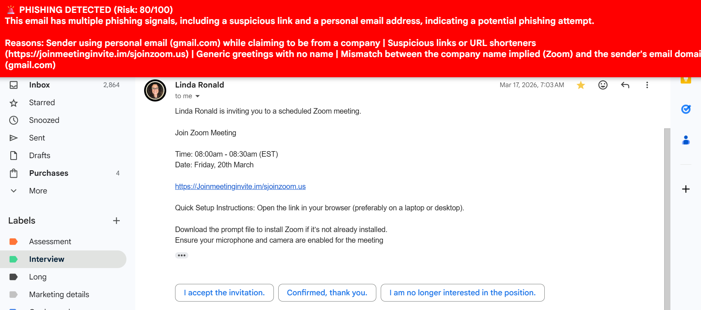

# 🛡️ Phishing Email Detector

An AI-powered Chrome extension that automatically scans emails in Gmail and alerts you in real-time if they are phishing attempts.

Built by a job seeker who got tired of fake recruiter emails.

---

## 🎯 Problem

Job seekers receive hundreds of emails during their search. Scammers exploit this by sending fake job offers, fake interview requests, and malicious links. These emails often bypass spam filters and land in your inbox.

## 💡 Solution

A Chrome extension that silently monitors Gmail and instantly shows a colored warning banner on every email you open:

- 🔴 PHISHING — Do not click anything
- 🟠 CAUTION — Be careful
- 🟢 SAFE — Looks legitimate

---

## 🏗️ Architecture

```
Gmail (Browser)
      ↓
Chrome Extension (content.js)
— Detects email open events via MutationObserver
— Extracts sender, subject, body, links
      ↓
FastAPI Backend (Python)
— Validates incoming data with Pydantic
— Sends email content to Groq LLaMA 3.3 70B
— Returns risk score + verdict + reasons
      ↓
Chrome Extension
— Displays real-time colored banner in Gmail
```

---

## 🛠️ Tech Stack

- **Backend:** Python, FastAPI, Uvicorn
- **AI:** Groq API (LLaMA 3.3 70B)
- **Extension:** JavaScript, Chrome Extension Manifest V3
- **Containerization:** Docker
- **Deployment:** Render (https://phishing-detector-itv1.onrender.com)

---

## 🚀 Running Locally

### Prerequisites
- Python 3.10+
- Groq API key (free at console.groq.com)
- Google Chrome

### Backend Setup

```bash
# Clone the repo
git clone https://github.com/yourusername/phishing-detector
cd phishing-detector/backend

# Create virtual environment
python -m venv venv
venv\Scripts\activate        # Windows
source venv/bin/activate     # Mac/Linux

# Install dependencies
pip install -r requirements.txt

# Add your Groq API key
echo "GROQ_API_KEY=your_key_here" > .env

# Run the server
uvicorn main:app --reload
```

### Chrome Extension Setup

1. Open Chrome and go to `chrome://extensions`
2. Enable **Developer Mode**
3. Click **Load Unpacked**
4. Select the `extension` folder
5. Open Gmail — the extension activates automatically

---

## 📡 API Endpoints

### POST /analyze

Analyzes an email for phishing signals.

**Request:**
```json
{
  "sender": "hr@amaz0n-jobs.com",
  "subject": "Urgent job offer",
  "body": "Dear candidate...",
  "links": ["http://suspicious-link.com"]
}
```

**Response:**
```json
{
  "risk_score": 98,
  "verdict": "PHISHING",
  "reasons": ["Suspicious domain", "Urgency language"],
  "summary": "High risk phishing attempt"
}
```

### GET /health

Returns server status.

```json
{"status": "ok"}
```

---

## 🔍 What It Detects

- Mismatched or spoofed sender domains
- Urgency and pressure language
- Requests for personal information or credentials
- Suspicious links and URL shorteners
- Too good to be true job offers
- Personal email accounts impersonating companies
- Generic greetings with no name

---

## 📸 Demo




---

## 🤝 Contributing

Pull requests welcome. This tool is built for job seekers — let's make it better together.